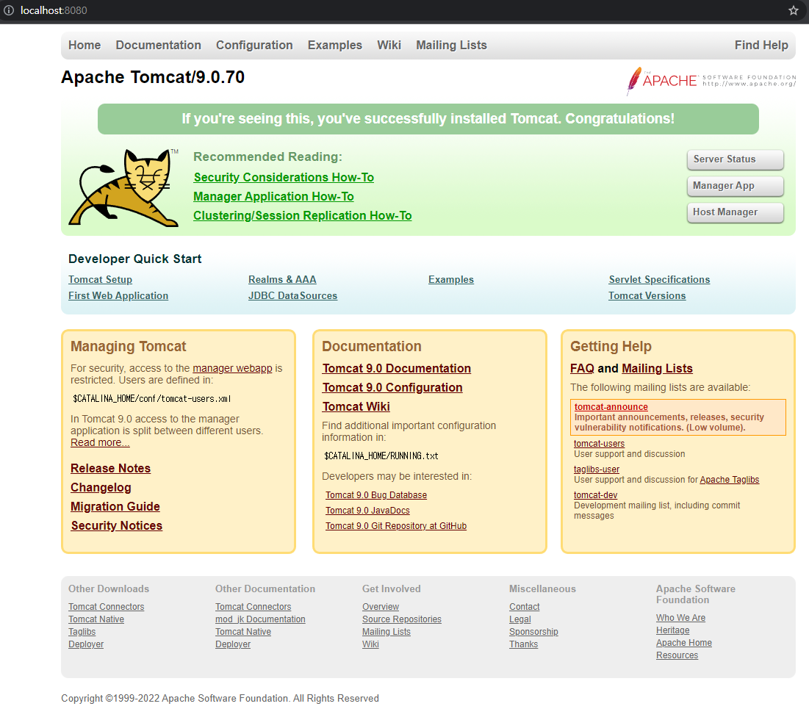

1. Tomcat 공식 페이지에서 다운받는다. 
Windows는 zip 다운, Mac은 tar 다운

2. 압축 풀고, bin\startup.bat 실행.  mac은 startup.sh 실행

3. 웹 브라우저에서 locahost:8080 실행 후 아래 화면이 나타나면 정상 실행이다.

## Tomcat 10을 쓰지 않고 9버전을 쓰는 이유
원본 링크 : https://blog.itcode.dev/posts/2022/02/12/tomcat-9-and-10
 \
Tomcat 9와 Tomcat 10는 API 구현체가 완전히 다르다.\
패키지 명이 아예 다르기에 Tomcat10과 9 버전은 호환되지 않는다.\
- JavaEE - Tomcat 9까지 적용됨 ( javax.* )
- JakartaEE - Tomcat 10부터 적용됨 ( jakarta.* )
 \
Orable이 Java를 인수하면서 라이센스로 인해 Java를 Java로 명명할 수 없어서\
Tomcat의 JavaEE를 JakartaEE으로 패키지명 명칭을 변경했다.
